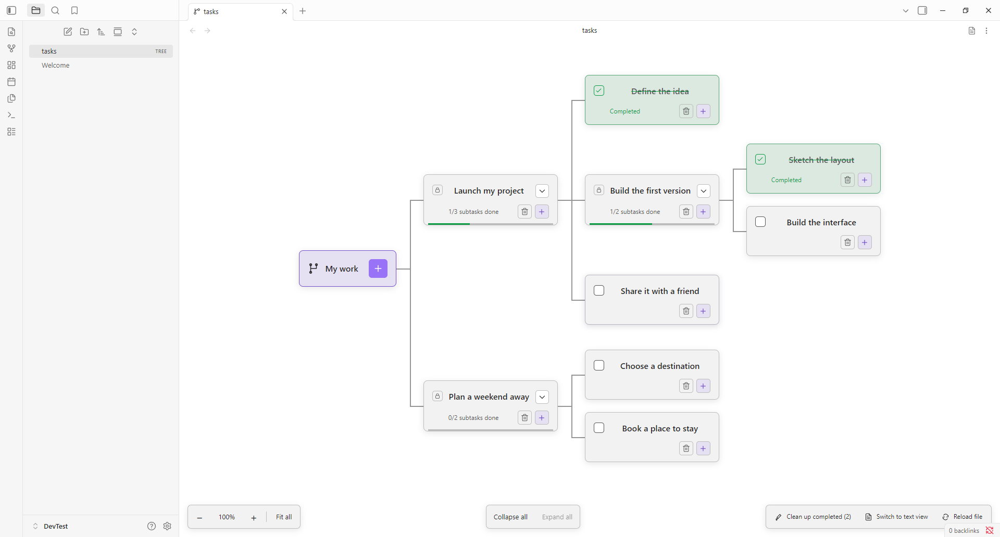

# Tree Work for Obsidian

An Obsidian plugin for task trees stored in plain-text **`.tree` files**. Opening one in your vault shows the interactive React graph. Each file is an independent tree; edits save directly through Obsidian's Vault API. No local server, database, network connection, or remote fonts are needed by the plugin.

Includes nested subtasks, completion rules, zoom, Fit all, collapsible branches, task focus, and Back to all tasks. The view uses your Obsidian theme's fonts and colors, and its CSS is scoped to Tree Work.



## Install locally

Requires Obsidian **1.6.0 or newer**.

1. Build with `npm install` and `npm run build`, or use the already-built `dist/tree-work` folder.
2. Copy that folder into `<your-vault>/.obsidian/plugins/tree-work/` (use your vault's actual configuration folder if customized).
3. Check that the folder directly contains **`manifest.json`**, **`main.js`**, and **`styles.css`**. Do not nest a second `tree-work` folder inside it.
4. Reload Obsidian, allow community plugins if necessary, and enable **Tree Work** under Settings → Community plugins.

After rebuilding, replace those three files and disable/re-enable the plugin or reload Obsidian. This is a local plugin build, not a published Community Plugins listing. Nothing is installed into your vault automatically.

## Create and open trees

- Run **Tree Work: Create new tree** in the command palette. Enter a name; `.tree` is added automatically. The destination follows Obsidian's new-file folder preference.
- Alternatively, right-click a folder in the file explorer and choose **New task tree** to create one there.
- Click a `.tree` file in the file explorer to open its graph. Duplicate names get a numeric suffix rather than overwriting existing files.
- A blank `.tree` file is a valid empty tree. The **+** on **My work** creates the first top-level task.
- You can also copy `examples/Example.tree` into your vault to try a sample task tree.

Tree Work registers the `tree` extension with its custom file view using Obsidian's public [plugin API](https://github.com/obsidianmd/obsidian-api). Markdown files and other extensions keep their existing behavior.

## File format

```text
- [ ] Launch my project
  - [x] Define the idea
  - [ ] Build the first version
    - [x] Sketch the layout
    - [ ] Build the interface
```

- One task per line; **two spaces per nesting level**.
- `- [ ]` means open; `- [x]` means completed. Uppercase `X` is accepted.
- Titles are plain text, 1–500 characters, without tabs or line breaks.
- UTF-8, LF, CRLF, a UTF-8 BOM, and blank lines are supported.
- Up to 10,000 tasks and 100 nesting levels.
- Parents can be completed manually only after every child is complete.
- Reopening a task or adding an unfinished child reopens all completed ancestors, even outside the focused view.

You can quickly reorganize, rename, or bulk edit tasks by switching to the built-in text view, or by editing the file in an external editor. Invalid files display an error and are never silently replaced with an empty tree.

## View modes and controls

### Switching between Tree View and Text View
- Click the **Switch to text view** button in the top-right pane header (file-text icon) or in the bottom toolbar.
- Alternatively, run **Tree Work: Switch between tree and text view** in the command palette.
- In text view, click **Switch to tree view** to save your edits and return to the visual graph.
- If a `.tree` file contains syntax errors (such as mismatched indentation), the view provides a direct **Switch to text view to fix file** button so you can resolve issues immediately without opening another editor.

### Text view editor features
- **Checklist shortcuts:** Pressing `Enter` on a task line automatically continues with `- [ ] `; pressing `Enter` on an empty checkbox line clears the checkbox prefix.
- **Indentation:** Pressing `Tab` inserts two spaces (or indents selected lines); `Shift+Tab` outdents lines.
- **Instant save:** Press `Ctrl+S` (or `Cmd+S` on macOS) or click **Save** to save immediately.
- **Live validation:** Live indicator shows whether the current text conforms to the `.tree` format and reports line-specific syntax errors in real time.
- **Line numbers:** Line counter helps quickly locate lines referenced in error messages.

### Graph controls

- **+** on My work adds a top-level task; **+** on a task adds a child.
- Checkboxes complete/reopen tasks. A lock means unfinished subtasks remain.
- **− / +** zoom the graph. The percentage resets to **100%**. **Fit all** fits the visible branches and follows changes in the pane size or tree.
- Chevrons collapse/expand branches; folded tasks show their hidden descendant count. **Collapse all / Expand all** operate on the current view.
- Click a title or card background to make that task the visible root. **Back to all tasks** restores My work. Focus changes fit the visible tree automatically.
- Task dialogs support Enter to submit and Escape to cancel.

Focus and collapse are temporary view state. They reset when the file is reopened or reloaded and are never written to the task file. Different panes have independent view state.

## Saving and external changes

Changes save immediately via `Vault.process`, with the source text checked inside the atomic update. If a file has changed in another pane or editor, saving is rejected until you reload. Other open Tree Work panes display a reload notice when the file changes. The reload also closes any add-task dialog because file edits may have changed task paths.

Each view's storage is bound to its own vault file. Renaming a file does not redirect edits elsewhere, and closing a view unregisters its listeners and React root. Normal vault operations handle file rename/delete and synchronization; Tree Work does not manage sync itself.

## Development and verification

Use Node.js 22.12+ (Node 24 recommended).

### Live development with auto-sync to your vault

To develop without manually copying files into your vault:

1. Set `VAULT_PATH` in a local `.env` file (ignored by Git) or environment:
   ```env
   VAULT_PATH=/path/to/your/vault
   ```
   *(On Windows/WSL, use your WSL mount path, e.g. `/mnt/c/Users/<user>/.../vault`)*

2. Run the watch script:
   ```sh
   npm run dev
   ```
   `esbuild` will recompile on file changes, output to `dist/tree-work/`, and automatically copy `main.js`, `styles.css`, and `manifest.json` into `<vault>/.obsidian/plugins/tree-work/`. It also creates `.hotreload` in the destination folder.

3. In your Obsidian vault, install and enable the **[Hot Reload](https://github.com/pjeby/hot-reload)** plugin. It detects `.hotreload` and automatically reloads Tree Work in Obsidian on every build without restarting the app.

### Commands

```sh
npm install
npm run build                  # type-check + production bundle (syncs to vault if VAULT_PATH is set)
npm run dev                    # watch mode with live sync
npm test                       # parser, task rules, vault storage, and file creation
node scripts/check-plugin.mjs  # verify package bundle and registration contract
```

Build output is `dist/tree-work/{main.js,manifest.json,styles.css}`. React is bundled; Obsidian is an external runtime dependency provided by the app. The manifest permits desktop and mobile because the plugin uses public vault and DOM APIs, not Node filesystem APIs.

Automated verification uses unit tests, API type-checking, and package checks only.

Suggested manual checks:

1. Enable the plugin and create/open an empty `.tree` file.
2. Add a parent and child; verify the parent stays locked until the child is done.
3. Close/reopen the file and confirm the task changes remain.
4. Try zoom, Fit all, folding, focus, and Back to all tasks in a narrow pane.
5. Open the same tree in two panes, save in one, and reload the other when notified.
6. Edit or rename the file externally, then reload; verify malformed text produces an error without overwriting it.

